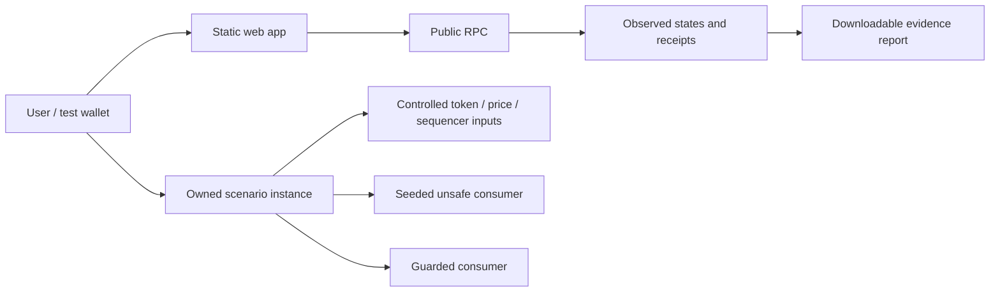

# Architecture and correctness

## Current foundation and intended flow

The app is a static React/TypeScript/Vite wallet lab using Viem. The landing-page previews remain explicitly illustrative. The execution panel runs all three families against wallet-owned `ScenarioInstance` contracts created by `ScenarioFactory`; consumers track synthetic collateral/debt with no token transfers. Reads and transaction evidence flow through the same `src/execution.ts` module used by the real-Anvil regression check. Reports use `cruxmark-evidence/2` and source provenance embedded during the build.

The diagram is implemented locally, and the factory is deployed and bytecode-verified on Robinhood Chain Testnet. The public-chain suite and a separate hosted-browser split run produced independently verified evidence, linked from `README.md`; the hosted-browser run used an ephemeral EIP-1193 test provider. The runtime default is local Anvil. Arbitrum Sepolia remains a deployment fallback, using the same mocks and accurately described scope.

## Input and unit contract

| Input/output | Unit and rule |
| --- | --- |
| `valueUsd18(rawBalance18)` | Receives raw stock-token units scaled by 1e18; returns USD scaled by 1e18 |
| `IFeed.latestRoundData()` | Price feed returns per-token USD scaled by its own `decimals()` |
| `IStockStatus.oraclePaused()` | Read on the **token**, not the price feed |
| `uiMultiplier()` | Shares per token scaled by 1e18; not another factor in per-token USD valuation |
| Raw underlying HTTP quote | Different type of input; requires an explicit shares-to-token conversion if supported later |
| Sequencer status | 0 means up; any other value is rejected by the prototype |

PriceGuard reads feed decimals each time, supports 0–18, rejects invalid/nonpositive price data, uninitialized/future timestamps, elapsed age greater than `maxAge`, a paused token, sequencer downtime, and elapsed recovery time less than or equal to `gracePeriod`. Parameters 300 seconds and 3600 seconds are **sandbox policy choices**, not universal official heartbeat/grace settings. Healthy data at exactly `maxAge` is accepted; recovery at exactly the grace limit is rejected.

Feed semantics, including price units and the pause flag, are documented in [Robinhood's oracle guide](https://docs.robinhood.com/chain/oracles-and-price-feeds/). Recovery checks follow the model in [Chainlink's L2 sequencer guide](https://docs.chain.link/data-feeds/l2-sequencer-feeds). These checks cannot make a dishonest upstream feed truthful.

The prototype accepts an 18-decimal stock balance and does checked multiplication before division. An extreme product reverts rather than wrapping. Supporting other asset decimals or wider balances requires a reviewed unit adapter and vetted full-precision multiplication. It does not validate custody or prove that the supplied balance belongs to an account; a future custody integration must read real token balance state.

## Supported scenarios

| Scenario | Controlled fault | Observable unsafe outcome | Required protected outcome |
| --- | --- | --- | --- |
| Split | Multiplier changes 1→2; per-token feed remains $100 | Consumer applies multiplier again, doubles collateral/borrow cap | $10k collateral remains $10k |
| Unavailable price | Pause flag true or feed age beyond configured limit, with positive answer | Consumer keeps approving price-sensitive action | Price-dependent action rejected; healthy control accepted |
| Sequencer | Down status; recovery timestamp; exact grace boundary | Consumer permits action despite unfair/stale market access | Down/grace action rejected; post-grace healthy action accepted |

Do not claim that a test transaction was mined during a genuine sequencer outage. We inject a controlled sequencer-status input while our test chain is functioning. In a real outage normal L2 submission may be unavailable. The test checks the consuming contract's behavior, not an outage of the chain itself.

All three families execute borrowing actions through actual unsafe/guarded consumers. Atomic configuration uses the executing chain timestamp, clears other faults and refreshes the price. The healthy sequencer control deliberately seeds a historical recovery timestamp; it does not simulate downtime of the actual chain.

## Scenario ownership and synthetic borrowing

Each run receives an owned scenario instance from the factory, with its own feeds, token status, guard and two consumers. A single shared oracle lets one user overwrite another's demonstration and is unacceptable for public run evidence. Current mock setters reject callers other than their deployer. Fault injection is available only in the owned sandbox; it must never mutate issuer contracts.

The consumers track per-account synthetic collateral/debt for the demonstration; any genuine token transfer must use a reviewed ERC-20 implementation and transfer handling. Apply price checks to **borrow** and any other unsafe price-dependent action. Keep **repay** and safe deposits callable without a price read. Do not make a global pause that prevents someone reducing debt. Add unauthorized mutation, reentrancy, duplicate action and balance accounting tests if custody is introduced.

## Evidence contract

A completed run's exported JSON should contain:

- Schema version, scenario ID/version and run ID.
- Chain ID; network name is display metadata. Actual RPC chain must match.
- Source commit and compiler/settings; deployed contract addresses and purposes.
- Selected adapter, feed units/decimals, max-age/grace assumptions, mock/live source labels.
- Exact input values/timestamps, action, expected outcome and **observed** outcome.
- Block numbers/hashes and timestamps for reads; successful/reverted transaction evidence when transactions are used.
- Confirmation state, receipt status and observed post-transaction state. A hash without a receipt is pending, not pass.
- Limitations and reproduction steps.

Serialize on-chain integers as decimal strings, not floating-point numbers. Never use JavaScript Number for token money. Capture reads consistently at a recorded block; a latest-state read later is not evidence for an earlier transaction. A rejected wallet signature is not a contract guard success. A revert from insufficient funds/gas is not the expected price-guard revert.

`pnpm run report:verify <file> [--rpc-url <url>] [--state]` re-checks an exported report against its chain instead of trusting the file. It first re-runs the structural validation, then reads the RPC for the report's chain and confirms the factory's runtime hash equals `source.factoryCodeHash`, the instance was created by that factory for the owner with every contract address matching, and for each action the receipt status, block number/hash/timestamp, sender, target, calldata and zero value, plus exactly one event naming the actor and amount (or the seeded fault and chain time), or no logs for a revert. These facts stay readable indefinitely. `--state` additionally re-reads every recorded snapshot and re-derives each rejection reason, which needs an RPC that still serves those blocks. An unreadable block or an RPC fault is reported as skipped or propagates; it is never counted as a mismatch, and a missing record is only "not found" when the node says so. The result trusts that RPC; it is not L1 finality, an attestation, or an audit. It is exercised against forged-but-self-consistent reports (swapped transaction, forged block hash or timestamp, forged owner, factory hash, contract address, amount, chain, status or state), against an RPC that lies about senders, targets, values or events, and through the real command line.

Reports are downloadable files first. A registry hash is optional and not needed to ship; if added, define canonical serialization and hash exactly the bytes exported. A hash is tamper evidence, not independent attestation. No database is required to preserve a user-downloaded report.

## Trust boundaries and validation

- Browser/wallet: connected account is untrusted input; enforce network selection, visible signing steps, user rejection and pending/error states.
- RPC: rate-limited, can fail or return stale data; validate chain ID, bound retries, report unknown/incomplete instead of pass.
- Oracle: upstream truth and heartbeat semantics are assumed; address verification, unavailable data and decimals matter.
- Token: pause/multiplier methods and 18-decimal assumption are specific supported semantics; incompatible ABIs fail closed.
- Time: use chain timestamps for assertions; browser time is display only. Reject future and zero input timestamps.
- Configuration: max age and grace must be appropriate for the feed and market; do not blindly reuse sandbox parameters on mainnet.
- Test coverage: known scenario coverage is not a comprehensive audit. Weekend closures, thin liquidity, liquidation execution, custody, issuer restrictions, bridge risk and pending corporate-action consistency are not yet modeled.

Future adapter/API work must check upstream errors, null vs false fields, effective timestamps, trading windows, feed errors and decimal boundaries. Do not claim live Robinhood sequencer-feed support on this testnet until its actual address and ABI are verified; a mocked recovery check is the supported initial scenario.

Meaningful checks now: seeded split regression, stale/paused positive prices, sequencer down/uninitialized/future/recovery boundaries, healthy controls, invalid prices/decimals/configuration, owner-only fault mutation, and fuzzed independence from the multiplier. The local execution suite verifies the lending harness and report consistency against actual transactions.

## Execution and report trust

Before signing, verify the selected RPC chain, wallet chain/account and exact compiled factory runtime hash. Accept creation only from a successful receipt with the factory’s matching `ScenarioCreated` event; verify owner and child bytecode before loading. Wallet account/network/disconnect events invalidate current run state. A synchronous operation lock covers multi-transaction deposit/repayment sequences. Deposits top up each observed balance to 100 synthetic tokens rather than adding another 100 after a partial retry.

Local development also offers an explicit opt-in provider for disposable unlocked Anvil accounts. Both app and RPC hosts must be loopback, the RPC must report chain 31337, and only the required Ethereum RPC methods are allowed. No private key enters the app. Public builds use browser-wallet signing. Wallet transports disable automatic request retries so an ambiguous write cannot be silently rebroadcast.

Failures are described from their error type, not their wording: a declined wallet prompt (a choice, shown calmly), missing gas funds, wrong network, a decoded contract rejection, a receipt timeout, and RPC failure, rate limit or timeout each get one actionable message. Our own curated errors pass through unchanged, and unrecognized errors show only viem's concise line, never its request dump. The mapping is exercised against real viem errors in `execution:test`.

Every snapshot reads inputs, collateral, debt, valuation and caps at one recorded block number, then checks that block’s hash again. Known guard reverts make valuation unavailable without hiding debt. Unknown errors, RPC failures and reorgs invalidate the observation. Successful and reverted receipts are retained for the selected run, with matching calldata and before/after state.

An expected rejection is preflight-decoded using the contract ABI. Only the exact expected guard error allows a deliberately reverting borrow to be signed with bounded gas. A rejection reason is also recorded only when the transaction used at most half of its 300,000 gas limit. A failure for lack of gas is a reverted receipt too, and replaying the call afterwards still decodes the guard's error, so it would otherwise pass as a rejection. Measured on a local chain: a clean guard rejection costs 38,877 gas, while starving the same call leaves almost nothing unused (29,984 of 30,000, because a nested-call out-of-gas leaves a sliver), so "used less than the limit" is not a safe test and proportion is. On Arbitrum-family chains the limit also pays the L1 data component, which read 6,921 gas on Robinhood Chain Testnet and 1,699 on Arbitrum Sepolia for the lab's calldata on October 2, 2026; if it ever grows enough to make a clean rejection look expensive, the check fails closed and verifies nothing. `report:verify` applies the same rule to every reverted record without needing state. A reverted receipt alone never proves the reason: the report explicitly identifies its reason as a same-block `eth_call` replay, which uses end-of-block state and is not a transaction trace. Coverage additionally checks recorded input conditions and debt changes. Report validation checks structure and internal consistency; it is not independent RPC verification, attestation or L1 finality.

The lab suggests the next control from those same recorded checks and the current snapshot. The suggestion is display guidance; it does not authorize, skip, or count an action. Reloading/selecting a run without its earlier browser-session history cannot manufacture earlier outcomes, so the suggestion starts again from the checks still in memory. Source/compiler/runtime hash are embedded by the build; dirty builds are explicitly labeled. Public release evidence must come from a clean source revision and matching deployed runtime.

Unresolved signing metadata is saved under a chain/factory/wallet-specific browser-storage key before updating the UI. Recovery validates ownership, re-reads the original block and only confirms the same submission; it never broadcasts. Wallet changes do not erase another wallet’s pending record. Timeouts preserve the write lock until confirmation is retried; mined replacements with different calldata invalidate the attempt rather than becoming passes.

Recovery and confirmation re-read state at the original and receipt blocks, and public RPCs prune that state: on October 2, 2026 the Robinhood Chain Testnet public RPC served about 15 minutes of history (~6,000 blocks) and the Arbitrum Sepolia public RPC between about 27 and 150 minutes, varying by request. A transaction that was dropped, or whose block state is gone, can therefore never be confirmed. **Discard saved transaction** is the explicit, confirmed exit. It removes only that wallet's saved record and drops any in-flight confirmation through the same epoch guard that wallet changes use, so a late receipt cannot record it. Discarding never counts a check; an action that did mine stays visible on the explorer but is outside this report. Receipts, calldata, block hashes and logs stay verifiable indefinitely; state snapshots need the RPC to still serve those blocks. Completed action history still belongs to the selected browser run; download the report before leaving it. Local-chain restarts invalidate transient addresses/history and require a fresh run.
