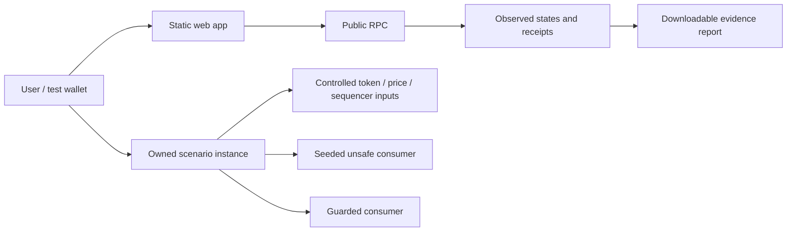

# Architecture and correctness

## Current foundation and intended flow

The current app is a static React/TypeScript workspace using Vite and Viem. It checks a selected RPC's actual chain ID and block. The contract foundation consists of a read-only `PriceGuard`, owner-controlled mock feed/token-status inputs, tests, and `DeploySandbox`. It has no ERC-20 custody, borrowing, external integration scanner, report registry, or scenario runner UI yet.

The unsafe consumer and runner in this diagram are planned. Keep deployment evidence separate from the diagram. The runtime default is local Anvil; the intended public demo is Robinhood Chain Testnet. Arbitrum Sepolia is a deployment fallback, using the same mocks and accurately described scope.

## Input and unit contract

| Input/output | Unit and rule |
| --- | --- |
| `valueUsd18(rawBalance18)` | Receives raw stock-token units scaled by 1e18; returns USD scaled by 1e18 |
| `IFeed.latestRoundData()` | Price feed returns per-token USD scaled by its own `decimals()` |
| `IStockStatus.oraclePaused()` | Read on the **token**, not the price feed |
| `uiMultiplier()` | Shares per token scaled by 1e18; not another factor in per-token USD valuation |
| Raw underlying HTTP quote | Different type of input; requires an explicit shares-to-token conversion if supported later |
| Sequencer status | 0 means up; any other value is rejected by the prototype |

PriceGuard reads feed decimals each time, supports 0–18, rejects invalid/nonpositive price data, uninitialized/future timestamps, elapsed age greater than `maxAge`, a paused token, sequencer downtime, and elapsed recovery time less than or equal to `gracePeriod`. Parameters 300 seconds and 3600 seconds are **sandbox policy choices**, not universal official heartbeat/grace settings. Healthy data at exactly `maxAge` is accepted; recovery at exactly the grace limit is rejected.

Feed semantics, including price units and the pause flag, are documented in [Robinhood's oracle guide](https://docs.robinhood.com/chain/oracles-and-price-feeds/). Recovery checks follow the model in [Chainlink's L2 sequencer guide](https://docs.chain.link/data-feeds/l2-sequencer-feeds). These checks cannot make a dishonest upstream feed truthful.

The prototype accepts an 18-decimal stock balance and does checked multiplication before division. An extreme product reverts rather than wrapping. Supporting other asset decimals or wider balances requires a reviewed unit adapter and vetted full-precision multiplication. It does not validate custody or prove that the supplied balance belongs to an account; a future consumer must read real balance state.

## Supported scenarios

| Scenario | Controlled fault | Observable unsafe outcome | Required protected outcome |
| --- | --- | --- | --- |
| Split | Multiplier changes 1→2; per-token feed remains $100 | Consumer applies multiplier again, doubles collateral/borrow cap | $10k collateral remains $10k |
| Unavailable price | Pause flag true or feed age beyond configured limit, with positive answer | Consumer keeps approving price-sensitive action | Price-dependent action rejected; healthy control accepted |
| Sequencer | Down status; recovery timestamp; exact grace boundary | Consumer permits action despite unfair/stale market access | Down/grace action rejected; post-grace healthy action accepted |

Do not claim that a test transaction was mined during a genuine sequencer outage. We inject a controlled sequencer-status input while our test chain is functioning. In a real outage normal L2 submission may be unavailable. The test checks the consuming contract's behavior, not an outage of the chain itself.

The current split test seeds the incorrect formula in the test and compares values. The next increment must move it into an explicit unsafe consumer and demonstrate a transaction/state change. Current unavailable/recovery checks already execute the guard on the local EVM.

## Scenario ownership and future lending harness

Each public run should receive isolated owned inputs, by deploying a small scenario instance or a minimal factory if reuse actually helps. A single shared oracle lets one user overwrite another's demonstration and is unacceptable for public run evidence. Current mock setters reject callers other than their deployer. Fault injection is available only in the owned sandbox; it must never mutate issuer contracts.

The next consumer can track synthetic collateral/debt for the demonstration; any genuine token transfer must use a reviewed ERC-20 implementation and transfer handling. Apply price checks to **borrow** and any other unsafe price-dependent action. Keep **repay** and safe deposits callable without a price read. Do not make a global pause that prevents someone reducing debt. Add unauthorized mutation, reentrancy, duplicate action and balance accounting tests if custody is introduced.

## Evidence contract

A completed run's exported JSON should contain:

- Schema version, scenario ID/version and run ID.
- Chain ID; network name is display metadata. Actual RPC chain must match.
- Source commit and compiler/settings; deployed contract addresses and purposes.
- Selected adapter, feed units/decimals, max-age/grace assumptions, mock/live source labels.
- Exact input values/timestamps, action, expected outcome and **observed** outcome.
- Block numbers/hashes and timestamps for reads; successful/reverted transaction evidence when transactions are used.
- Confirmation state, receipt status and observed post-transaction state. A hash without a receipt is pending, not pass.
- Limitations and reproduction steps.

Serialize on-chain integers as decimal strings, not floating-point numbers. Never use JavaScript Number for token money. Capture reads consistently at a recorded block; a latest-state read later is not evidence for an earlier transaction. A rejected wallet signature is not a contract guard success. A revert from insufficient funds/gas is not the expected price-guard revert.

Reports are downloadable files first. A registry hash is optional and not needed to ship; if added, define canonical serialization and hash exactly the bytes exported. A hash is tamper evidence, not independent attestation. No database is required to preserve a user-downloaded report.

## Trust boundaries and validation

- Browser/wallet: connected account is untrusted input; enforce network selection, visible signing steps, user rejection and pending/error states.
- RPC: rate-limited, can fail or return stale data; validate chain ID, bound retries, report unknown/incomplete instead of pass.
- Oracle: upstream truth and heartbeat semantics are assumed; address verification, unavailable data and decimals matter.
- Token: pause/multiplier methods and 18-decimal assumption are specific supported semantics; incompatible ABIs fail closed.
- Time: use chain timestamps for assertions; browser time is display only. Reject future and zero input timestamps.
- Configuration: max age and grace must be appropriate for the feed and market; do not blindly reuse sandbox parameters on mainnet.
- Test coverage: known scenario coverage is not a comprehensive audit. Weekend closures, thin liquidity, liquidation execution, custody, issuer restrictions, bridge risk and pending corporate-action consistency are not yet modeled.

Future adapter/API work must check upstream errors, null vs false fields, effective timestamps, trading windows, feed errors and decimal boundaries. Do not claim live Robinhood sequencer-feed support on this testnet until its actual address and ABI are verified; a mocked recovery check is the supported initial scenario.

Meaningful checks now: seeded split regression, stale/paused positive prices, sequencer down/uninitialized/future/recovery boundaries, healthy controls, invalid prices/decimals/configuration, owner-only fault mutation, and fuzzed independence from the multiplier. The lending integration and report checks belong to the next milestones.
